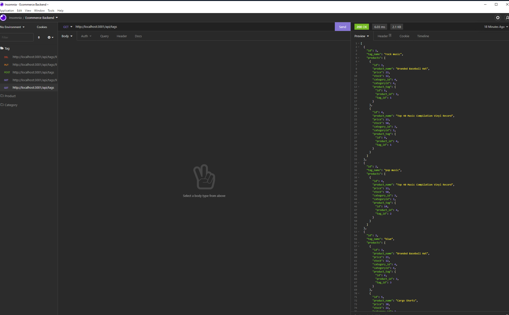

# Ecommerce Back-End

## Description

In this project, I created an Ecommerce back-end with the use of Sequelize. This project began with starter code. Therefore I had to fill in spots, and complete the project by connecting the back-end.

Once the database is created, seeded, and started, the user can use an application such as Insomnia or Postman in order to access or interact with the database. For each of the categories, products, or tags, the user can view all, view an individual one, create a new one, update an existing one, or delete an existing one.

I finished this project using Javscript and Node.js. I also used Sequelize in order to connect to the SQL database. The dotenv package was used in order to store sensive data. Express.js was also used in order to configure routing.

This project was fairly simple, as most of the code was provided. The project's readme helped guide me through what I would need to do in order to complete the project. However, I had to educate myself on how to use Sequelize and practice with it. Overall, I would say the project was very educational and beneficial for my skill stack.

**Link** 

YouTube Demonstration: https://youtu.be/8gGqp9VLECI